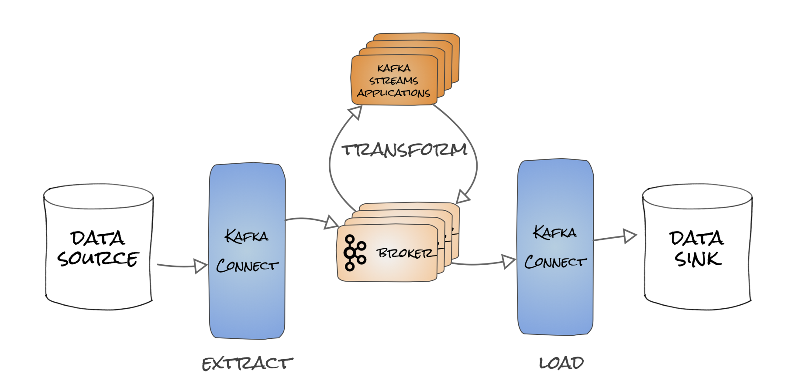
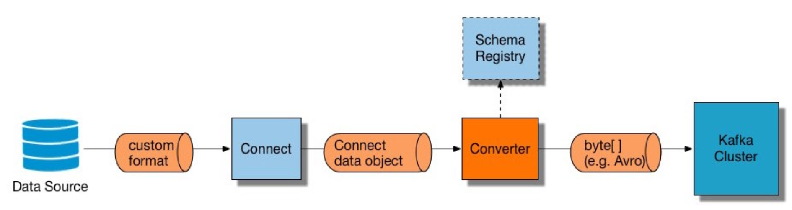
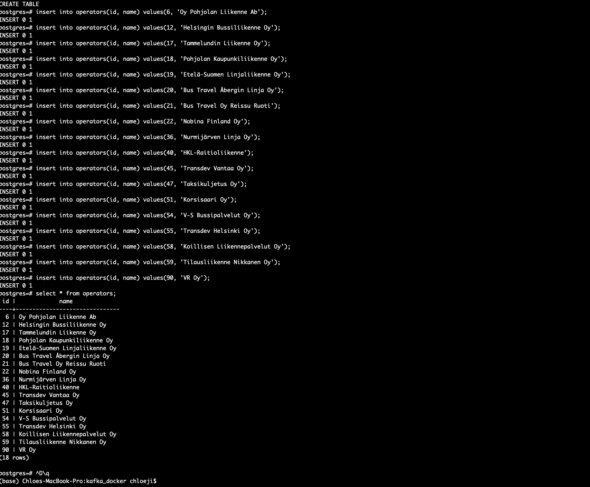
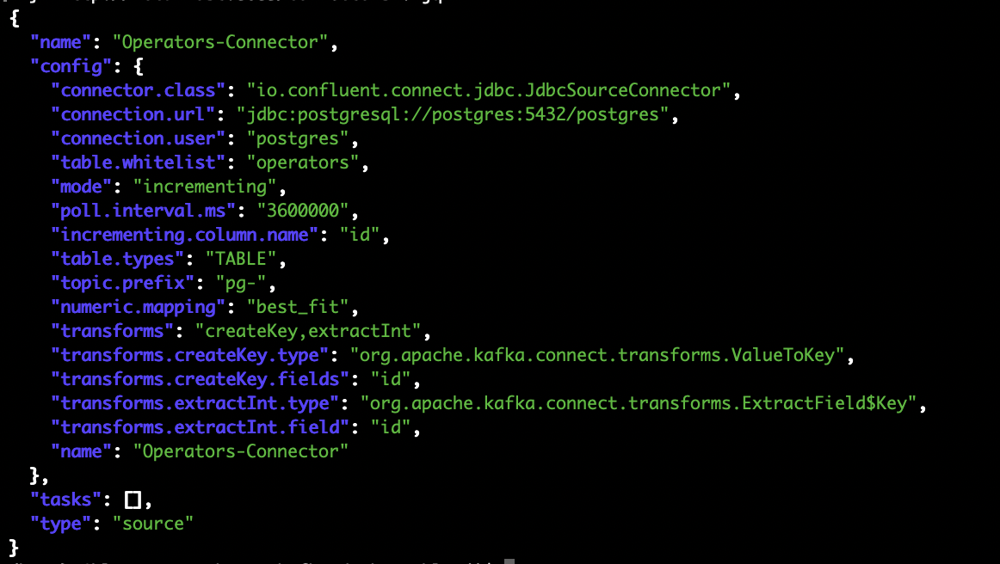
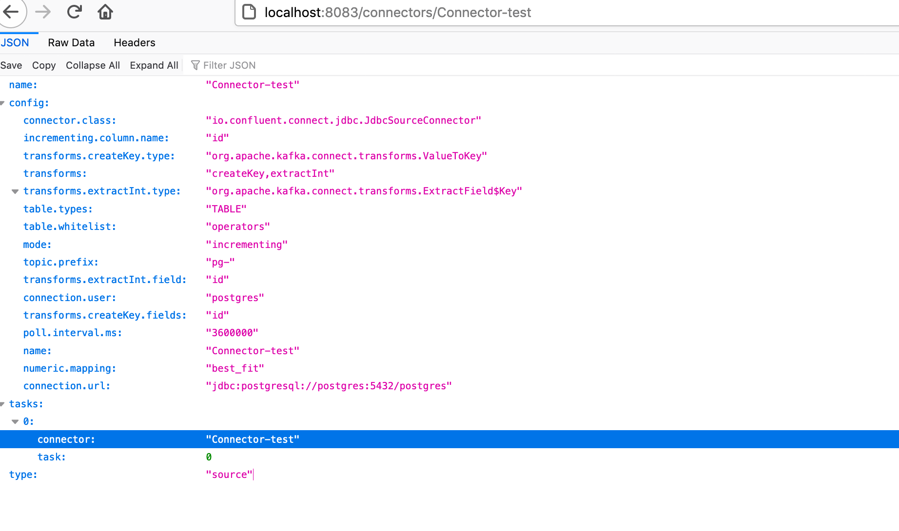
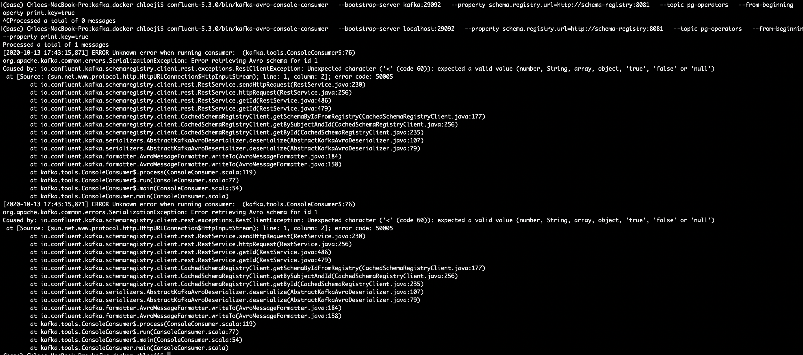
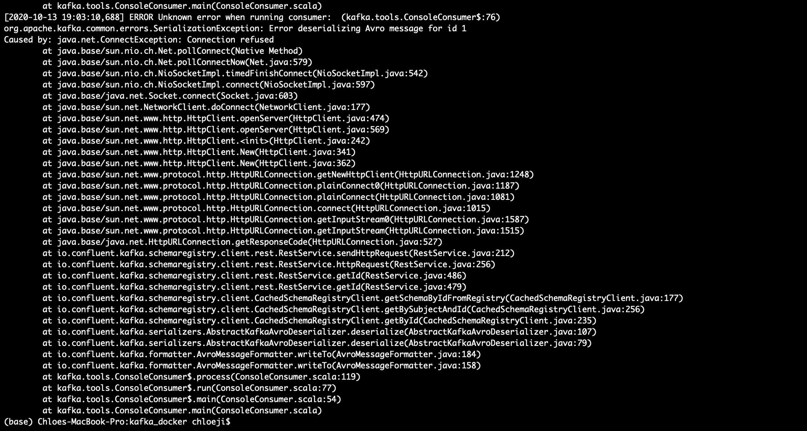
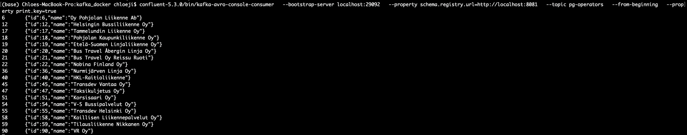

Based on blogs from Robin and training course notes for Kafka Connect session,
- <a href="https://rmoff.net/2020/10/01/ingesting-xml-data-into-kafka-option-2-kafka-connect-plus-single-message-transform/">Ingesting XML data into Kafka - Option 2: Kafka Connect plus Single Message Transform</a>
- <a href="https://www.confluent.io/blog/kafka-connect-deep-dive-jdbc-source-connector/">Kafka Connect Deep Dive – JDBC Source Connector</a>
- <a href="https://rmoff.net/2020/06/19/how-to-install-connector-plugins-in-kafka-connect/">How to install connector plugins in Kafka Connect</a>
- <a href="https://rmoff.net/2020/02/25/kafka-connect-jdbc-sink-setting-the-key-field-name/">Kafka Connect JDBC Sink - setting the key field name</a>
- <a href="https://rmoff.net/2020/01/22/kafka-connect-and-schemas/">Kafka Connect and Schemas</a>
- <a href="https://rmoff.net/2020/01/16/changing-the-logging-level-for-kafka-connect-dynamically/">Changing the Logging Level for Kafka Connect Dynamically</a>
- <a href="https://rmoff.net/2020/01/08/streaming-messages-from-rabbitmq-into-kafka-with-kafka-connect/">Streaming messages from RabbitMQ into Kafka with Kafka Connect</a>
- <a href="https://rmoff.net/2019/11/29/kafka-connect-request-timed-out/">Kafka Connect - Request timed out</a>
- <a href="https://rmoff.net/2019/11/22/common-mistakes-made-when-configuring-multiple-kafka-connect-workers/">Common mistakes made when configuring multiple Kafka Connect workers</a>
- <a href="https://rmoff.net/2019/10/15/skipping-bad-records-with-the-kafka-connect-jdbc-sink-connector/">Skipping bad records with the Kafka Connect JDBC sink connector</a>

https://docs.confluent.io/current/connect/index.html

```
worker(coordinator)-> connector->task 
confluent-hub install debezium/debezium-connector-mysql:latest 

connect-standalone connect-standalone.properties \
connector1.properties [connector2.properties connector3.properties ...]

#distributed mode 
connect-distributed connect-distributed.properties

#config workers
# 1. Distributed mode in /etc/kafka/connect-distributed.prop
# 2. Standalone mode in /etc/kafka/connect-standalone.properties

//Common Worker Configuration
//see more on https://docs.confluent.io/current/connect/references/allconfigs.html#common-worker-configuration
bootstrap.servers
key.converter
value.converter
offset.storage.file.filename

//Configuring Workers: Distributed Mode
group.id
session.timeout.ms
heartbeat.interval.ms
config.storage.topic
offset.storage.topic
status.storage.topic

//Configuring Connectors with Confluent Control Center

```


//converter 

```
key.converter=io.confluent.connect.avro.AvroConverter
key.converter.schema.registry.url=http://schemaregistry1:8081
value.converter=io.confluent.connect.avro.AvroConverter
value.converter.schema.registry.url=http://schemaregistry1:8081
```

## Connector 1 
#### JDBC Source Connector to load RDBMS to Kafka broker

DBC Source Connector: Configuration
1. connection.url
2. topic.prefix
3. mode
4. query
5. poll.interval.ms
6. table.blacklist
7. table.whitelist

set up mysql docker -> docker exec mysql inside docker 
```
docker-compose exec postgres psql -U postgres
CREATE TABLE operators(
  id int not null primary key,
  name varchar(50) not null
);

```


Configure the source connector
create a new topic-> 
```
confluent-5.3.0/bin/kafka-topics \
--bootstrap-server localhost:29092 \
--create \
--topic pg-operators \
--partitions 1 \
--replication-factor 1
```
Ingest data:
Add a JDBC source connector via command line and REST API of Connect-> **jq** is Json parser, use `brew install jq` 
```
curl -s -X POST \
  -H "Content-Type: application/json" \
  --data '{
  "name": "Operators-Connector",
  "config": {
  "connector.class": "io.confluent.connect.jdbc.JdbcSourceConnector",
  "connection.url": "jdbc:postgresql://postgres:5432/postgres",
  "connection.user": "postgres",
  "table.whitelist": "operators",
  "mode":"incrementing",
  "poll.interval.ms" : 3600000,
  "incrementing.column.name": "id",
  "table.types": "TABLE",
  "topic.prefix": "pg-",
  "numeric.mapping": "best_fit",
  "transforms": "createKey,extractInt",
  "transforms.createKey.type":
"org.apache.kafka.connect.transforms.ValueToKey",
  "transforms.createKey.fields": "id",
  "transforms.extractInt.type":
"org.apache.kafka.connect.transforms.ExtractField$Key",
  "transforms.extractInt.field": "id"
  }
  }' http://localhost:8083/connectors | jq
```

error:
```
{
  "error_code": 500,
  "message": "Failed to find any class that implements Connector and which name matches io.confluent.connect.jdbc.JdbcSourceConnector, available connectors are: PluginDesc{klass=class org.apache.kafka.connect.file.FileStreamSinkConnector, name='org.apache.kafka.connect.file.FileStreamSinkConnector', version='6.0.0-ccs', encodedVersion=6.0.0-ccs, type=sink, typeName='sink', location='file:/usr/share/java/kafka/'}, PluginDesc{klass=class org.apache.kafka.connect.file.FileStreamSourceConnector, name='org.apache.kafka.connect.file.FileStreamSourceConnector', version='6.0.0-ccs', encodedVersion=6.0.0-ccs, type=source, typeName='source', location='file:/usr/share/java/kafka/'}, PluginDesc{klass=class org.apache.kafka.connect.mirror.MirrorCheckpointConnector, name='org.apache.kafka.connect.mirror.MirrorCheckpointConnector', version='1', encodedVersion=1, type=source, typeName='source', location='file:/usr/share/java/kafka/'}, PluginDesc{klass=class org.apache.kafka.connect.mirror.MirrorHeartbeatConnector, name='org.apache.kafka.connect.mirror.MirrorHeartbeatConnector', version='1', encodedVersion=1, type=source, typeName='source', location='file:/usr/share/java/kafka/'}, PluginDesc{klass=class org.apache.kafka.connect.mirror.MirrorSourceConnector, name='org.apache.kafka.connect.mirror.MirrorSourceConnector', version='1', encodedVersion=1, type=source, typeName='source', location='file:/usr/share/java/kafka/'}, PluginDesc{klass=class org.apache.kafka.connect.tools.MockConnector, name='org.apache.kafka.connect.tools.MockConnector', version='6.0.0-ccs', encodedVersion=6.0.0-ccs, type=connector, typeName='connector', location='file:/usr/share/java/acl/'}, PluginDesc{klass=class org.apache.kafka.connect.tools.MockSinkConnector, name='org.apache.kafka.connect.tools.MockSinkConnector', version='6.0.0-ccs', encodedVersion=6.0.0-ccs, type=sink, typeName='sink', location='file:/usr/share/java/acl/'}, PluginDesc{klass=class org.apache.kafka.connect.tools.MockSourceConnector, name='org.apache.kafka.connect.tools.MockSourceConnector', version='6.0.0-ccs', encodedVersion=6.0.0-ccs, type=source, typeName='source', location='file:/usr/share/java/acl/'}, PluginDesc{klass=class org.apache.kafka.connect.tools.SchemaSourceConnector, name='org.apache.kafka.connect.tools.SchemaSourceConnector', version='6.0.0-ccs', encodedVersion=6.0.0-ccs, type=source, typeName='source', location='file:/usr/share/java/acl/'}, PluginDesc{klass=class org.apache.kafka.connect.tools.VerifiableSinkConnector, name='org.apache.kafka.connect.tools.VerifiableSinkConnector', version='6.0.0-ccs', encodedVersion=6.0.0-ccs, type=source, typeName='source', location='file:/usr/share/java/acl/'}, PluginDesc{klass=class org.apache.kafka.connect.tools.VerifiableSourceConnector, name='org.apache.kafka.connect.tools.VerifiableSourceConnector', version='6.0.0-ccs', encodedVersion=6.0.0-ccs, type=source, typeName='source', location='file:/usr/share/java/acl/'}"
}

check Connector jar in kafka-conenct-jdbc and config connection endpoint.
```
Get Return Output, which tell if works,  


Check topics->


Use Avro-Consumer to consume from broker->
```
confluent-5.3.0/bin/kafka-avro-console-consumer \
  --bootstrap-server localhost:29092 \
  --property schema.registry.url=http://localhost:8081 \
  --topic pg-operators \
  --from-beginning \
  --property print.key=true
```

Get output data, fix avro error by this <a href="https://rmoff.net/2016/12/02/kafka-avro-console-producer-error-registering-avro-schema-/-io.confluent.kafka.schemaregistry.client.rest.exceptions.restclientexception/">solution</a>.

Connection error

Result ->


Clean up
```
docker-compose down -v
```

Conclusion:
*Connection to endpoint will easily caused errors, so make sure connection is right.
